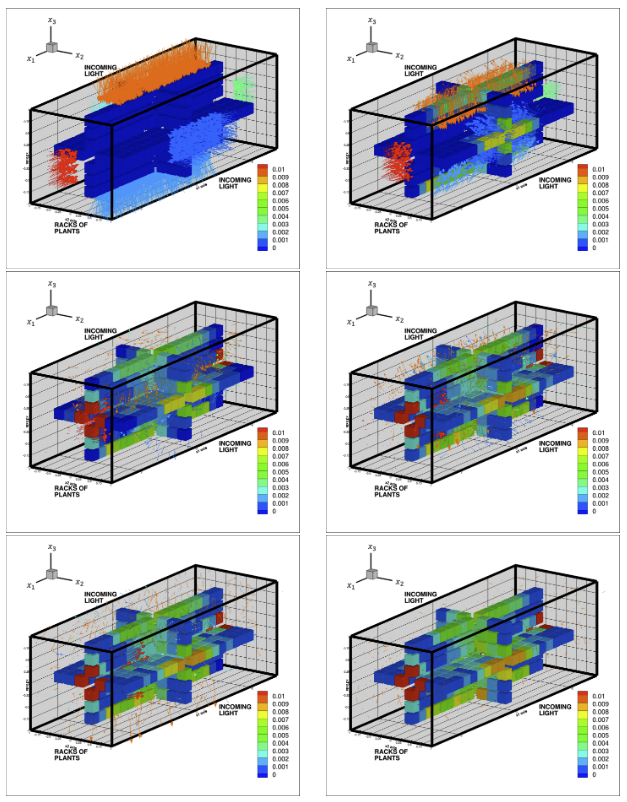
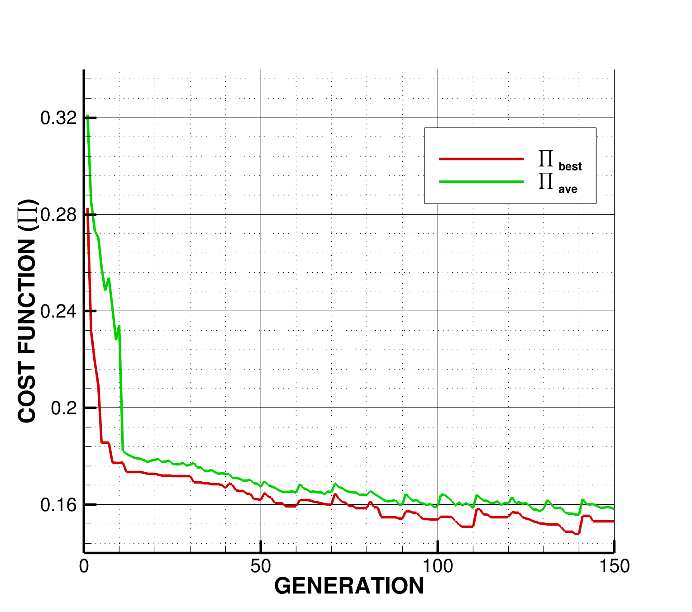
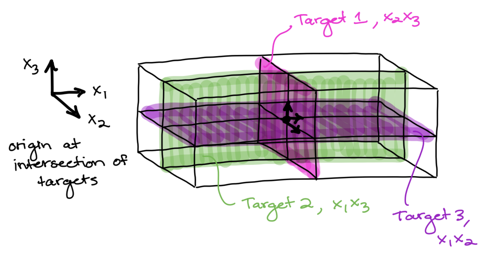
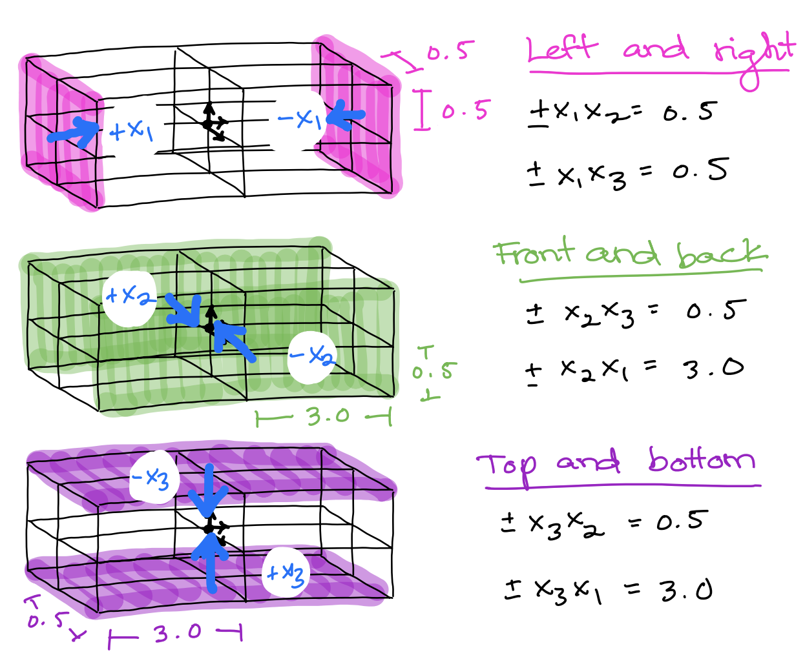

**Introduction** <br />
In the face of a changing climate and a rising number of "food deserts" in both rural and urban areas, there is a demand to supply fresh produce year-round to communities at the end of the traditional agriculture supply chain. Vertical indoor farming is a promising mode of next-generation agriculture that boasts reduced water and pesticide usage, improved yields, more consistent quality, year-round cultivation, and cheaper transportation and harvesting costs. Indoor farms can rival industrial greenhouses in size, but small-scale "pod farms" can be deployed to smaller communities and areas where large swaths of land are either unavailable or too costly. These pods are often the size of shipping containers with their temperature, humidity, and plant nutrient supply carefully controlled. Plants inside the pods are grown hydroponically with light supplied by panels of LEDs and, thus, this mode of farming is fundamentally different from greenhouse farming. Many indoor farming pods have recently become commercially available claiming high energy efficiency, but little analysis and optimization work has been done to prove these claims. To drive innovation in the design of these physical systems, we have developed a digital-twin and genomic optimization framework for the optical design of vertical indoor farming pods. We model a completely enclosed indoor farming pod with plants in the three mutually-orthogonal planes and illuminated by LED "walls." We employ ray-tracing methods and a genetic algorithm to determine the LED source tube area size, beam aperture spread, and power requirements for maximal power absorption by the plants.

**Results** <br />
 <br />
Optimal indoor farming system light pulse snapshots. Ray color added for visual clarity. Colorbar added to show differential power absorption by plants. Red corresponds to higher power absorption and blue to lower power absorption <br />

 <br />
Cost function evolution over 150 generations. The plots shows the cost of the best performing design (red) and the average cost of the entire population (green) as a function of successive generations. The Genetic Algorithm (GA) was allowed to re-adapt every 10 generations. The lowest cost in generation 1 was ~0.2826 and was reduced to ~0.1531 by generation 150. This is a reduction of ~45.82%. <br />

**Setup** <br />
There are two python versions, one C version, and one Fortran version of this project. For results consistent with those in the publication "A digital-twin and rapid optimization framework for optical design of indoor farming systems," we recommend running the Fortran version. <br />

To run Fortran code, be sure to check your system meets the following requirements.
1. Download and install compiler at https://www.scivision.dev/intel-oneapi-fortran-install/ <br />
2. Download install files from here: https://www.intel.com/content/www/us/en/developer/articles/news/free-intel-software-developer-tools.html <br />
3. Install “Base Kit” and “HPC Kit” to get everything needed <br />
4. Specify compiler location by following these instructions: https://www.intel.com/content/www/us/en/docs/fortran-compiler/developer-guide-reference/2023-0/specifying-the-location-of-compiler-components.html <br />
5. In a terminal window, run ```source /<install-dir>/setvars.sh intel64``` e.g., if the install directory is /opt/intel/oneapi/, run: source ```/opt/intel/oneapi/setvars.sh intel64``` <br />
6. (Optional) If you want this command to always run everytime you open the terminal you can add that line to your ~/.bash_profile or ~/.zshrc (whichever file is sourced in your terminal login shell <br />

Once you know your system meets the above requirements, follow the steps below to run any Fortran code in the terminal. <br />
Guide to using the compiler from the command line: https://www.intel.com/content/www/us/en/docs/fortran-compiler/developer-guide-reference/2023-0/invoke-the-compiler.html <br /><br />
```
$ source /opt/intel/oneapi/setvars.sh intel64 <br />
$ ifort {filename} -lm -03 -o {object filename} <br />
$ ./{object filename} <br />
```

**Running** <br />
Now that you know how to run any Fortran file, to **run the indoor farming "lightbox" model by itself,** <br />
1. Navigate to "INDOOR_FARMING_PAPER/Codebase/FORTRAN/MODEL/"
2. Identify the file "PURE-RAY-LIGHTBOX.f" with the latest version number e.g. V13 is later than V12. Then, where <XX> is the latest version number, run <br />
3. ifort PURE-RAY-LIGHTBOX-V<XX>.f -lm -03 -o PURE-RAY-LIGHTBOX-V<XX>.o <br />
4. ./PURE-RAY-LIGHTBOX-V<XX>.o <br />
5. After the executable file runs, a file "PATH.dat" will be created. <br />
6. Using your visualization software of choice (we use Tecplot to produce the plots in the associated paper), you can visualize the data in PATH.dat. <br />

In PATH.dat, each line represents the data in a time step. The columns represent the following data: <br />
Column 1: ray x-position <br />
Column 2: ray y-position <br />
Column 3: ray z-position <br />
Column 4: target radius <br />
Column 5: normalized reflectance <br />
Column 6: ray x-velocity <br />
Column 7: ray y-velocity <br />
Column 8: ray z-velocity <br />
Column 9: power-weighted ray x-velocity <br />
Column 10: power-weighted ray y-velocity <br />
Column 11: power-weighted ray z-velocity <br />
Column 11: unused variable <br />
Column 12: ray wavelength <br />

If you desire to edit the model file ("PURE-RAY-LIGHTBOX.f"), we only recommend editing in a few locations (line numbers based on v13): <br />
Line 76: MOVIE=1 to produce movie, MOVIE=0 to run faster and save data storage. <br />
Lines 80-85: 1 to activate a rack, 0 to deactivate. <br />
Lines 91-108: Aperature parameters, should have values between 0-1. <br />
Lines 114-125: Source tube parameters, must be greater than zero, though we recommend between 0-3. <br />
Lines 131-136: Total face power parameters, must be greater than zero, though we recommend between 0-10. <br />

Now that you know how to run the indoor farming "lightbox" model by itself, to **run the optimization of the indoor farm optical parameters,** <br />
1. Navigate to "INDOOR_FARMING_PAPER/Codebase/FORTRAN/GA/"
2. Identify the file "MACHINE-LEARNING-PURE-RAY-LIGHTBOX.f" with the latest version number e.g. V13 is later than V12. Then, where <XX> is the latest version number, run <br />
3. ifort MACHINE-LEARNING-PURE-RAY-LIGHTBOX-V<XX>.f -lm -03 -o MACHINE-LEARNING-PURE-RAY-LIGHTBOX-V<XX>.o <br />
4. ./MACHINE-LEARNING-PURE-RAY-LIGHTBOX-V<XX>.o <br />
5. After the executable file runs, a file "PATH.dat" will be created. <br />
6. Using your visualization software of choice (we use Tecplot to produce the plots in the associated paper), you can visualize the data in PATH.dat, which shows how energy is distributed within the optimized indoor farm settings given by the algorithm. <br />
7. You can generate the cost function evolution plot (depicted above) by plotting the cost against the number of generations. Note that in the code, variable *MINIMUM* is the index of the string with the minimum cost. You can access the minimum cost value using *FITNESS(MINIMUM)*. <br />
8. **TODO** Were there more steps than this ???
  
If you desire to edit the model file ("MACHINE-LEARNING-PURE-RAY-LIGHTBOX.f"), we only recommend editing in a few locations (line numbers based on v15): <br />
Line 267: PRINTSCREEN=0 to suppress prints to console while running (recommended when running optimization). PRINTSCREEN=1 to allow prints to console. <br />
Line 268: OVERRIDE=0 to suppress creation of PATH.dat for a movie (recommended when running optimization). OVERRIDE=1 to create PATH.dat for a movie. <br />
Line 304: Change Genetic Algorithm (GA) stopping tolerance. <br />
Lines 320-337: The intial values for aperatures. <br />
Lines 341-352: The initial values for source tubes. <br />
Lines 356-361: The initial values for face power. <br />
Line 367-369: Toggles for whether or not the GA re-adapts every few generations. <br />
Line 430: KEEP=1 to retain parents in new generations. KEEP=0 to discard parents. <br />
Lines 460-477: Upper search bounds for aperatures (lower bound for all is 0). <br />
Lines 483-494: Upper search bounds for source tubes (lower bound for all is 0).<br />
Lines 500-505: Upper search bounds for face power (lower bound for all is 0). <br />

**A Note on Notation**
 <br />
We call the planes in which plant racks exist the "target planes." The planes targeted in the paper associated with this repo are planes x1x2, x1x3, and x2x3, which are visualized in the drawing above. <br />

 <br />
Each source tube exists on one wall of the indoor farming pod. We refer to the source tube dimensions first according to their surface normal and second according their measurements along the dimensions defining the wall to which they belong. For example, the wall with surface normal +x3 has one source tube on it. That source tube covers some area in the x1 direction and some in the x2 direction, covering some area on the wall defined by surface normal +x3. In the code, the variables FORPLUSX3SOURCETUBEX1 and FORPLUSX3SOURCETUBEX2 define the area covered by the source tube. <br />

**Authors** <br />
Emre Mengi <br />
Carla Becker <br />
Mostafa Sedky <br />
Shao-Yi Yu <br />
Tarek Zohdi <br />

**Contact** <br />
emre_mengi@berkeley.edu <br />
carlabecker@berkeley.edu <br />
msedky@berkeley.edu <br />
syyu410@berkeley.edu <br />
zohdi@berkeley.edu <br />

**Citation** <br />
Mengi, E., Becker, C.J., Sedky M., Yu S., and Zohdi, T.I. A digital-twin and rapid optimization framework for optical design of indoor farming systems.  Computational Mechanics (2023). https://doi.org/10.1007/s00466-023-02421-9 <br />

**License** <br />
No licensing at this time -- all open source. <br />

**Acknowledgments** <br />
Firstly, we would like to thank our advisor Tarek Zohdi for his contributions to this work and for his support and guidance while working on this project. We would also like to acknowledge Jim Pantaleo, the Industry Ambassador at AIFS, and Hanna Bartram, the former Education and Public Engagement Coordinator at AIFS. <br />

**Funding** <br />
This work has been partially supported by the UC Berkeley College of Engineering and the USDA AI Institute for Next Generation Food Systems (AIFS), USDA award number 2020-67021-32855.
